# How to use this repository?
## Prerequisites - set your environment and IDE

To begin, let's assume you don't have any working environment but only a Linux machine. Follow the steps to prepare your machine, start with installing newer versions of the existing packages on the machine:<br>
```$ sudo apt-get upgrade```

* Check if there is Java on your machine by running the command ```$ java --version```; if not, install the latest package of Java:
```$ sudo apt-get install default-jre```.
* Run the command ```$ java --version``` that should return the latest version.
* Next, install the latest JDK (javac):
``$ sudo apt-get install default-jdk``.<br>
* Verify the Java development kit was installed properly by running the command ``$ javas --version``, it should return the latest version.

Lastly, install an IDE. I chose to use IntelliJ IDEA, but feel free to choose any other IDE [here is a comparison][1].
Follow the instructions in this guide to [install IntelliJ IDEA on Ubuntu][2]

[1]: https://www.javaworld.com/article/3114167/choosing-your-java-ide.html
[2]: https://itsfoss.com/install-intellij-ubuntu-linux

## Setting the project
1. Download the repository or clone it locally.
2. Open IntelliJ.
3. Click on Import Project, select the flink-demo, which is under the root folder you've downloaded from GitHub.
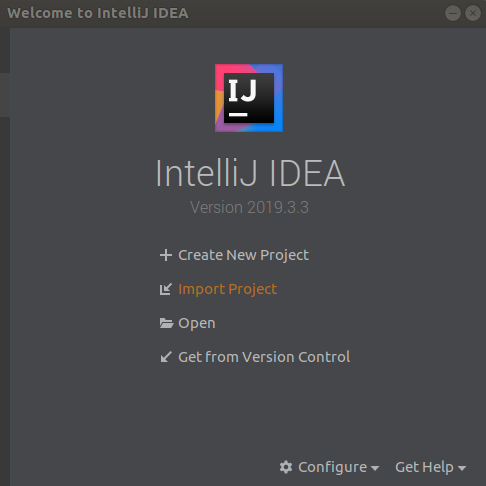
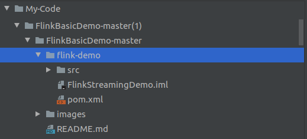
4. Select Maven as the external module.
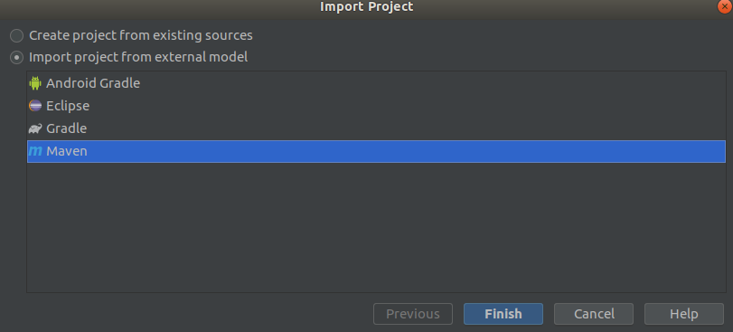

## The project structure and folders

After opening the project witn intelliJ, open Project Sessting --> Modules. There you should see the following structure and configuration:
1. Project's sources
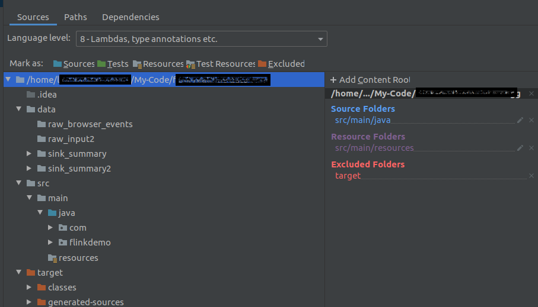
2. Project's paths
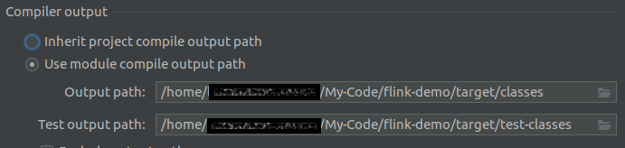
3. Project's dependencies
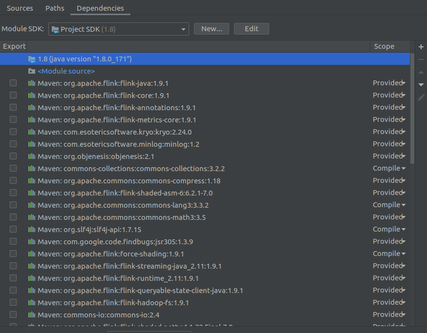

The outline of the project's files and folders should be:


## Compile and Run
After building the project, you can run the main application:
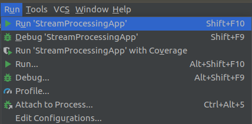

If you have compilation problems or runtime errors, please refer to the Troubleshooting clause.

## Troubleshooting

In case of problems in compiling or running the project, verify the following:

### Verify the project's definitions are correct
1. Verify the correct JVM is associated with the project.
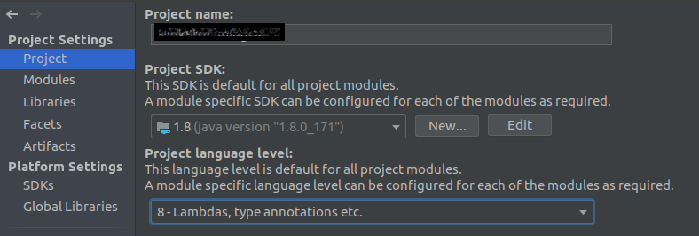
2. Make sure the Java and Flink packages are included in the compilation; otherwise, you might encounter compilation errors.
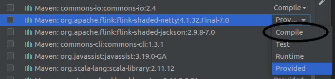
3. If the pom.xml file cannot be found, you will receive the alert below; then, set the project as a Maven project.
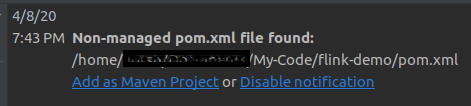
4. Another alert might be related to importing Maven dependencies. Setting Auto-Import can assist.
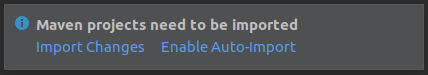

## Feedback

Hope you find this repository useful; feel free to engage me.


